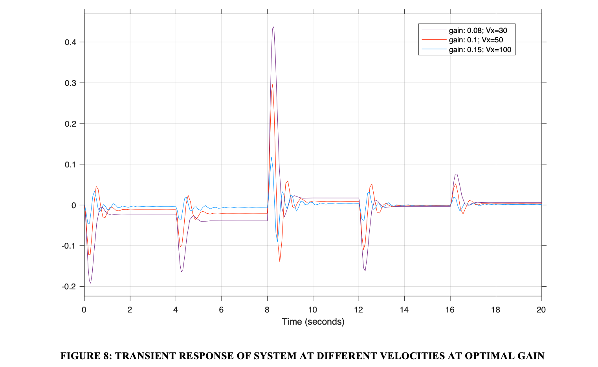

# **Examining State Variable Feedback and Proportional Control Strategies For an Automated Lane Keeping System**

## _Mark Breen &amp; James O&#39;Connor_

_Institute of Technology, Sligo_

# Introduction

Automated lane keeping has been built into commercial vehicles since 2001 (IVSource, 2001) and is becoming an increasingly important area of study in the field of ADAS and autonomous vehicles. In this report, we aim to investigate a number of approaches to the design of an automated lane keeping control system. Two fields of control design were investigated, State Variable Feedback (SVF) and Proportional Control (PC). In almost every situation, there are some control strategies that are more suited to the problem than others. The rationale for this report is to compare and contrast these two control strategies in terms of their benefits and limitations for maintaining the position of a vehicle in the centre of the road as it turns corners. The vehicle parameters chosen for the simulations have all been derived from a commercially available vehicle and all road parameters are in line with design parameters for roads in Ireland.

# 2. Model Design

## 2.1. Vehicle Parameters

An Audi A4 was chosen as a vehicle to use for simulations. This vehicle was chosen because it is common on Irish roads and the saloon form factor is also common in Ireland. The specifications of this vehicle were taken from a brochure on the manufacturer&#39;s website (Audi Ireland, 2020). The specifications of interest are listed in Table 1

**Table 1: Specifications of the 2020 Audi A4 taken from the manufacturer&#39;s website**

|  **Specification Name** | **Value** | **Units** |
| --- | --- | --- |
|  **Wheelbase** | 2.820 | Metres |
|  **Wheel track**  | 1.546 | Metres |
|  **Vehicle length**  | 4.770 | Metres |
|  **Vehicle height**  | 1.408 | Metres |
|  **Mass**  | 2005 | Kilograms |

The yaw inertia of the vehicle is required for the proceeding methodologies. In order to estimate this yaw inertia, an approach derived from Monte Carlo methods was used (Fundowicz &amp; Sar, 2018).

The vehicle parameters were used as input for this set of five equations and an average was taken as this was thought to best estimate of the true yaw inertia of the vehicle.

In order to estimate the tyre corner stiffness, basic tyre information was used as input for the methodology outlined in a mathematical model derived from considering the tyre to be a combination of two independent systems (Hewson, 2005).

The tyre chose was a 205/55 R18 tyre in line with our vehicle specifications (Bridgestone, 2020). The tyre specifications are displayed in Table 2

**Table 2: Specifications chose for the 205/55 R18 tyre**

| **Specification Name** | **Value** | **Units** |
| --- | --- | --- |
| _Tyre thickness_ | 0.015 | Metres |
| _Tyre width_ | 0.205 | Metres |
| _Tyre aspect ratio_ | 55 | Percent |

## 2.2. Road Simulation Parameters Vx, R

To select reasonable velocities and radii of curvature, the following source was used from Transport Infrastructure Ireland, describing road specifications in Ireland (Ireland, 2005).

Three values were selected to measure response at high, medium and low velocities; 100km/h, 50km/h and 30km/h. These represent typical speed limits in Ireland in both urban and rural environments. As the document did not specify a minimum radius of curvature for 30km/hr, an extrapolated value of 300m was selected for this velocity. Calculating the destination yaw rate as the velocity divided by the radius of curvature yielded the following parameters:

| _ **Run** _ | _ **Velocity** _ | _**Vx (km/hr)**_ | _**Vx (m/s)**_ | _**R (m)**_ | _**Yaw\_des (rad/s)**_ |
| --- | --- | --- | --- | --- | --- |
| _1_ | Low | 30.00 | 8.33 | 300.00 | 0.028 |
| --- | --- | --- | --- | --- | --- |
| _2_ | Medium | 50.00 | 13.89 | 510.00 | 0.027 |
| _3_ | High | 100.00 | 27.78 | 2040.00 | 0.014 |

## 3.2. Lookahead Control Strategy Using Proportional Controller – By James O&#39;Connor

### 3.2.1. Overview

The lookahead control strategy consists of measuring the current cross track error and the projected cross track error at a future point in time. This future point in time is called the lookahead distance. In the below analysis, the state space bicycle model was used to model the system.

Proportional control involves the selection of a gain value that corresponds to a time response satisfying design specifications (ScienceDirect, 2019). In basic proportional control, this gain is used as a multiplier of the error signal, which essentially gives greater magnitude to greater error signals.

### 3.2.2. Methods For Selecting Parameters

In order to help decide the parameters of this system, specifically gain K, the root locus method was used for each simulation in this section to approximate the lower and upper bounds of the gain value in which the system would remain stable. The aim was to move as far away from the marginally stable origin axis, without increasing the imaginary element of our poles for this system. This ensures that our system is as stable as possible with low oscillations and the response times are as fast as possible within the constraints of this system. Some examples of root locus analysis are shown in the below sections.

To use the root locus method, we had to alter our state-space bicycle model equations to work in the Laplace domain. As Laplace transfer functions are single input single output, we separate the inputs, B1 and B2, and combine our two error measurement outputs, the cross track-error and heading angle relative to each individual input.

An sensible baseline lookahead distance of 20 meters was chosen for the initial simulations. Once this baseline had been determined, a more optimal parameter selection process was investigated in section 3.2.4.

To select the values for poles and zeros for the lead compensator, again a root locus plot was used. A more detailed explanation is outlined in section 3.2.6.

### 3.2.3. Basic Proportional Control

#### 3.2.3.1. Simulation - 30km/hr

From studying the zero poles and root locus plots, it was observed that the optimal range for the gain was in the range of 0.07-0.01 range. As we increase past 0.1m, we lose damping and increase oscillations.

The output from Simulink as plotted below in Figure 5 demonstrates the response of the system at gains from 0.01 to 0.3.

As predicted by the root locus plots, increasing the gain, to a point adds damping and reduces the oscillation in our system. However, once this gain is increased past this point, it marginally improves the steady state error, but this also increases our settling time and the response becomes more oscillatory, which would result in an unstable and laterally jerky behavior.

#### 3.2.3.2. Simulation – 50km/hr

For the second run, the velocity and radius of curvature have increased, thus changing our yaw\_des value. The root locus method was again used to find suitable values for the gain, and a step input was used to generate a disturbance to our Simulink model.

For the sake of clarity, the number of different gains tested here have been reduced to four; 0.01, 0.03, 0.1, 03. Here we can see the impact of positive crossing the real axis. With a gain of 0.01, the poles have crossed the origin, and results in an unstable system. A gain of 0.1 gave us the best result, however oscillation and overshoot are still present.

#### 3.2.3.3. Simulation – 100km/hr

As velocity increase, the dominant poles on the root locus plots moved further to the right if the imaginary axis. This suggests that he faster we travel, the higher the gain needs to be in order to keep the system stable, which makes sense intuitively. Plotting 0.01 in this experiment, after the 10 second runtime became severely unstable. Therefore a higher upper and lower bound of gain was used in thus simulation.

As we can see here, at faster velocities, the gain needs to be larger in order to keep the system stable. The root locus plot indicated this and was proven through the Simulink outputs. Interesting to note the level of oscillation at higher speeds, much more noticeable and harder to overcome than the 30km/hr and 50km/hr values. After the three runs, the below gains were observed to be within the optimal value for this system.

**Table 4: Gain Range For optimal Response of System at different velocities**

| _ **Velocity** _ | _**Vx (km/hr)**_ | _**Vx (m/s)**_ | _**R (m)**_ | _ **Gain Range** _ |
| --- | --- | --- | --- | --- |
| _Low_ | 30.00 | 8.33 | 300.00 | 0.07-0.1 |
| --- | --- | --- | --- | --- |
| _Medium_ | 50.00 | 13.89 | 510.00 | 0.1 - 0.15 |
| _High_ | 100.00 | 27.78 | 2040.00 | 0.2 to 0.3 |

### 3.2.4. Investigating the Impact of Velocity on The System

Now that we have investigated an adequate range for the gain, let us compare the different velocity responses relative to one another, at their optimal gains. Instead of using a step input, a random number signal input was used, with a normal distribution of -yaw\_des to yaw\_des for each velocity. The signal changes every four second to simulate a change in steering angle. This better simulates road-like conditions – and gives us a better indication of the accumulation of our steady state errors over time. Again we are looking at a lookahead distance of 20m.

At lower velocities, the response is less oscillatory, but less responsive resulting in bigger error signals and a shorter settling time. At higher velocities the response is more oscillatory, more responsive with smaller error signals and longer settling time. Note in this scenario the steady-state error worked itself out, but this is due to the car turning in both directions, if this was a circuit track the steady state errors would build up over time.

### 3.2.5. Investigating the Impact of Lookahead Distance on The System

Once a baseline simulations had been run for a lookahead distance of 20m, the lookahead distance was altered to test the impact that this parameter had on the transient response. From (J. Park, 2014)a formula for calculating an optimal lookahead distance based on velocity, per kph, was derived as follows:

After some initial simulations using the values for K at the original lookahead distance of 20m, it was clear that the values for K were too low for the shorter lookahead distances, especially in the case of 30km/hr. Therefore a more appropriate gain was selected based on the root locus plots for the system. Using the above equation to calculate the lookahead distance, the results for K and L were calculated as follows:

**Table 5: Optimal Lookahead Distances At different velocities**

| _**Vx (km/hr)**_ | _**Lookahead (m)**_ | _ **K** _ |
| --- | --- | --- |
| _30_ | 8.7 | 0.3 |
| --- | --- | --- |
| _50_ | 12.7 | 0.35 |
| _100_ | 22.7 | 0.08 |

This demonstrates the optimal value for each of the variables, Lookahead and Gain using only proportional control. In order to investigate the effect that the lookahead distance has on the response of this system, three simulations at Vx = 50 were conducted, varying only the lookahead distance. The lookahead distances from the previous simulation were used. A step input signal was used for this simulation.

This proved the theory outlined in the above paper and demonstrated how we can improve our steady state error and reduce our overshoot with an optimal lookahead distance.

### 3.2.6. Investigating the Impact of a Lead Compensator

It is clear that although proportional control can be used as a corrective controller, it creates oscillation within the response signal, increasingly so with increases in velocity. To improve the transient response, a lead compensator can be used. The concept of a lead compensator is that by adding additional poles and zeros to the system we can alter its behavior in ways that we cannot with pure proportional control. Although this adds another level of complexity to our system, there is a significant level of oscillation to remove with basic proportional control.

The positioning of these additional poles are critical in predicting the desired response. As oscillation and overshoot are high in our previous simulations, the zeros and poles for the lead compensator were placed at -1 and -6 respectively. This should result in an active response, increasing damping and reducing oscillations in our error signal. Using the same parameters as the previous section for Vx of 50, a gain of 0.35 was used in the lead compensator design.

By adding a lead compensator we have improved the level of oscillations in our system. We have also increased the steady state error here, however we can use feedforward to correct for this.

# 4. Controller Comparison

## 4.1. State Variable Feedback Vs Proportional Control

State variable feedback does a great job at minimising the heading error but appears to fall short with regards to minimising the cross-track error. As can be seen in Sections 3.1.4, 3.1.5 and 3.1.6, the cross-track error ranges from 7cm in the simulation of the 30km/h scenario all the way up to 18cm in the 100km/h scenario.

The state variable feedback approach settles down to a steady state very quickly in all testing scenarios. Practically this means that passengers in this vehicle would be able to enjoy a smooth ride without much jerky motion. From observation, the state variable feedback technique works best at medium speed (50km/h).

Proportional control is difficult to compare to SVF in terms of the individual error response signals as we have converted the state-space model to SISO laplace transformations, and combined the error signal into a single output. However, looking at the transient response of SVF to PC, it is clear that SVF offers a much better shape of response, correlating to a much smoother response to a disturbance, which is particularly important from a passenger&#39;s perspective. Proportional control, by itself as demonstrated is sufficient at low speeds (less than 50km/hr) and slight changes in heading angle. However, at higher speeds, a high level of oscillation is unavoidable, the system becomes unstable and this is where the SVF offers a much better alternative. By introducing a lead compensator to a PC system, we can get closer to the transient response offered by SVF at higher speeds.

# 5.Recommendations for Future Development and Testing

By incorporating a feedforward element to the state variable feedback implementation, the cross-track error could be eliminated in both simulations. This, along with the fact that the heading error is very small means that state variable feedback with a feedforward element could be a very useful technique to use even at high speeds.

In testing SVF it was observed that there seemed to be a trade-off in optimisation between the cross-track and heading error. In future implementations, this trade-off could be better managed as it seems that in its current implementation the heading error is very well optimised, but this means that the cross-track error is disproportionately large compared to the heading error. In a future implementation a Linear Quadratic Regulator (LQR) controller could be implemented, a technique in which the engineer specifies the relative weighting between minimisation of error and minimisation of the control signal. This might help to reduce the larger cross-track errors at high speed.

From a PC perspective, an integrative and derivative action could be implemented instead of a lead compensator to remove the oscillatory behaviour of PC by itself. Similarly, as derivative action does not work well with noise disturbance, such would be the case while driving down the road, a combination of lead compensation and integrative action without derivative action could be implemented to ensure that over time the car gradually moves back to the centre of the road and offers a much more enjoyable journey for the passenger.

# 6. Bibliography

Audi Ireland, 2020. _Audi A4 2020 Product Guide._ [Online]
 Available at: https://www.audi.ie/dam/nemo/ie/Downloads/A4/A4-Product-Guide.pdf

Bridgestone, 2020. _Bridgestone.co.nz._ [Online]
 Available at: https://www.bridgestonetyres.co.nz/how-to-read-your-tyre-size
 [Accessed 2020].

Fundowicz, P. &amp; Sar, H., 2018. _Estimation of mass moments of inertia of automobile._ Casta, Slovakia, IEEE, pp. 1-6.

Hewson, P., 2005. Method for estimating tyre cornering stiffness from basic tyre information. _roceedings of The Institution of Mechanical Engineers Part D-journal of Automobile Engineering - PROC INST MECH ENG D-J AUTO,_ pp. 1407-1412.

Ireland, T. I., 2005. _www.tiipublications.ie._ [Online]
 Available at: https://www.tiipublications.ie/library/DN-GEO-03031-05.pdf
 [Accessed 2020].

IVSource, 2001. _ivsource.net._ [Online]
 Available at: https://web.archive.org/web/20050110073214/http://ivsource.net/archivep/2001/feb/010212\_nissandemo.html
 [Accessed 2020].

J. Park, S. B. B. K. a. J. K., 2014. _When path tracking using look-ahead distance about the lateral error method and the velocity change method tracking comparison._ Seoul, s.n.

ScienceDirect, 2019. _Science Direct._ [Online]
 Available at: https://www.sciencedirect.com/topics/engineering/proportional-control
 [Accessed 2020].